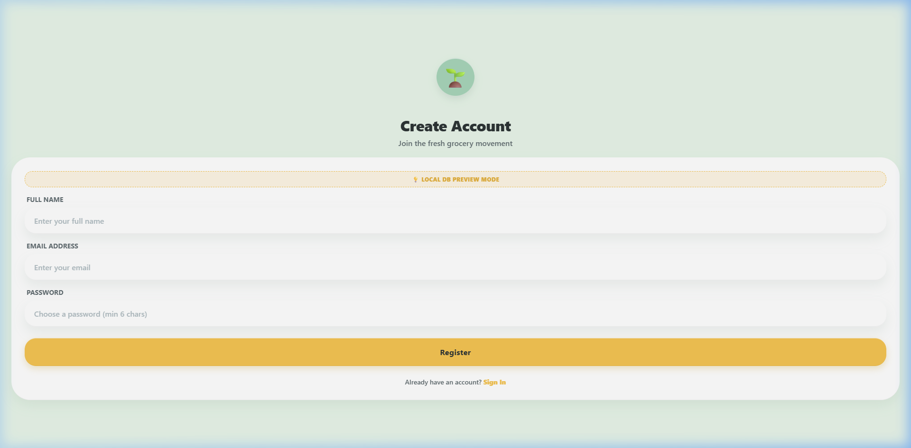
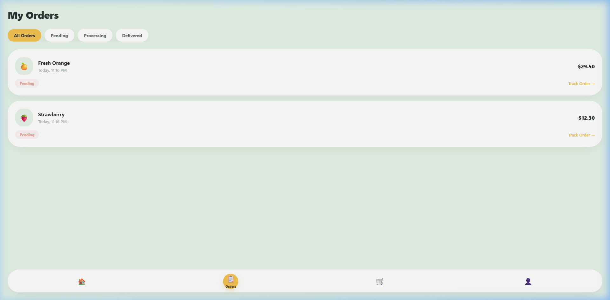

# 🛒 Gronur - Claymorphism Grocery App

[](https://reactnative.dev/)
[](https://expo.dev/)
[](https://firebase.google.com/)
[](https://www.sqlite.org/)
[](https://opensource.org/licenses/MIT)

A stunning, highly animated grocery store mobile application built with **React Native (Expo)** featuring **Claymorphism**—a cutting-edge user interface trend leveraging soft pillowy shadows, curved corners, and pastel colors to simulate a 3D tactile physical card design. 

This project integrates a **dual-driver backend system**: real **Firebase Authentication & Cloud Firestore** for cloud accounts, alongside dynamic **local SQLite database** fallbacks for sandboxed testing.

---

## 📸 App Previews

| Registration & Authentication | Dynamic Placed Orders History |
| :---: | :---: |
|  |  |

---

## ✨ Features

* **🎨 Tactile Claymorphism Design System:**
  * Curated pastel canvas palettes (soft mint backgrounds, warm gold primary accents, coral and lavender trims).
  * Double-layered border highlights (top semi-transparent white highlight + bottom drop-shadow) to emulate physical clay thickness in code.
  * Deep blur, pillowy card shadows and customizable radii.
* **⚡ Squishy Spring Interactions:** Reusable animation hooks leveraging React Native's core `Animated` driver (staggered list entrance feeds, infinite pulsing illustration headers, parallax scroll offsets, and scale-down spring button feedbacks).
* **🔒 Secure Cloud Authentication (Firebase):** Production-ready sign up, login, and secure user sessions using Firebase Auth.
* **☁️ Cloud Firestore Database:** Stores user profiles and processes customer purchases dynamically into real-time database collections.
* **💾 Local SQL Failback (SQLite):** Leverages `expo-sqlite` (for native iOS/Android builds) and a custom Web Storage driver (for browser web previews). If Firebase keys are absent, the app automatically runs in a sandboxed, zero-config local mode.
* **🚚 Animated Delivery Tracking Map:** Fun mock map interface plotting routes, moving delivery vehicles, and animating driver details with direct call integration.

---

## 📂 Project Architecture

```
gronur-claymorphism/
├── App.js                       # Root Application wrapper & Global Contexts
├── package.json                 # Core dependencies & scripts
├── src/
│   ├── animations/
│   │   └── useClayAnimations.js # Reusable Animated spring hooks
│   ├── assets/                  # Images, icons, and walkthrough captures
│   ├── components/
│   │   └── ClayPrimitives.js    # Reusable clay UI components (Cards, Inputs, Buttons)
│   ├── context/
│   │   └── AuthContext.js       # Dynamic session state & DB operations manager
│   ├── database/
│   │   └── db.js                # SQLite native transaction manager & Web fallbacks
│   ├── firebase/
│   │   └── firebase.js          # Firebase app configuration & connection observer
│   ├── navigation/
│   │   └── AppNavigator.js      # Protected stack router & Custom Tab navigations
│   └── screens/
│       ├── OnboardingScreen.js  # Playful entry screen with slide-up sheets
│       ├── LoginScreen.js       # Claymorphic login page with mode warnings
│       ├── RegisterScreen.js    # Account creation form
│       ├── HomeScreen.js        # Grocery category lists and product catalogs
│       ├── ProductDetailScreen.js # Dynamic item inspector, counters, and reviews
│       ├── CheckoutScreen.js    # VISA payments & orders summary placements
│       ├── MapTrackingScreen.js # Interactive tracking routing sheet
│       └── OrdersScreen.js      # Dynamic list querying orders history
```

---

## 🚀 Getting Started

Follow these instructions to run the application on your computer.

### 📋 Prerequisites
Make sure you have Node.js installed. We recommend installing the Expo Go client app on your physical mobile phone if you wish to run it on native iOS/Android.

### 🔧 Installation
1. Clone this repository to your machine.
2. Open terminal inside the project root folder and install packages:
   ```bash
   npm install
   ```

### 💻 Running the App
* **To run the Expo Web Preview (Browser):**
  ```bash
  npm run web
  ```
  *This compiles the React Native styles into a web-bundle serving on `http://localhost:19006/`.*

* **To run on mobile devices (Expo Go / Simulator):**
  ```bash
  npx expo start
  ```
  *Scan the QR code displayed in the terminal with your phone camera to load the app in Expo Go.*

---

## 🔑 Database & Cloud Configuration

Out of the box, the app runs in **Local SQLite Sandbox mode** (no backend configurations required). To link the app to your own live Firebase Cloud dashboard:

1. Create a project in the [Firebase Console](https://console.firebase.google.com/).
2. Enable **Email/Password Provider** inside *Authentication*.
3. Initialize a **Cloud Firestore Database** in your console.
4. Go to project settings, register a web application, and copy your `firebaseConfig` keys.
5. Open [src/firebase/firebase.js](file:///c:/Users/Sutanu%20Ballav/Desktop/gronur%20claymorphism/src/firebase/firebase.js) and paste your credentials:
   ```javascript
   export const firebaseConfig = {
     apiKey: "YOUR_API_KEY",
     authDomain: "YOUR_AUTH_DOMAIN",
     projectId: "YOUR_PROJECT_ID",
     storageBucket: "YOUR_STORAGE_BUCKET",
     messagingSenderId: "YOUR_MESSAGING_SENDER_ID",
     appId: "YOUR_APP_ID"
   };
   ```
6. Save the file. The app will auto-detect the configuration changes and connect immediately to Firebase cloud sync!

---

## ⚙️ Key Code Snippets

### 🧪 Dual-Mode Database Execution Adapter
We implemented a resilient database executor to maintain preview compatibility:
```javascript
// From src/database/db.js
if (Platform.OS === 'web') {
  // Web Fallback: LocalStorage simulation database
  executeSql = async (sql, params = []) => {
    const norm = sql.replace(/\s+/g, ' ').trim();
    if (norm.includes('INSERT INTO users')) {
      const [name, email, password] = params;
      const users = getTable('users');
      // local validation...
      users.push({ id: users.length + 1, name, email, password });
      saveTable('users', users);
      return { rows: [], insertId: users.length, rowsAffected: 1 };
    }
    // ...other query fallbacks
  };
} else {
  // Native Driver: Real SQLite on iOS & Android
  const SQLite = require('expo-sqlite');
  const db = SQLite.openDatabase('gronur.db');
  executeSql = (sql, params = []) => {
    return new Promise((resolve, reject) => {
      db.transaction(tx => {
        tx.executeSql(sql, params, (_, res) => resolve(res), (_, err) => reject(err));
      });
    });
  };
}
```

### 🎨 Modeling Clay Borders in React Native CSS
Since standard React Native CSS styles do not support inner-shadow configurations, we custom-modeled clay structures by sandwiching upper highlights and lower drop-shadows:
```javascript
// Base Clay Card Primitives
const content = (
  <View style={[{ 
    borderRadius: ClayRadius.xl, 
    backgroundColor: ClayColors.surface, 
    padding,
    borderTopWidth: 1, 
    borderTopColor: 'rgba(255,255,255,0.7)', // Simulate light reflection
    borderBottomWidth: 1, 
    borderBottomColor: 'rgba(0,0,0,0.04)',    // Faint bottom thickness
  }, style]}>
    {children}
  </View>
);
```

---

## 📝 License
This project is licensed under the MIT License - see the LICENSE file for details.
